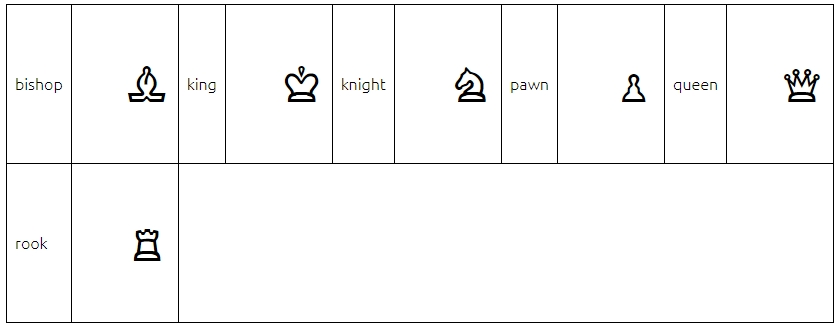
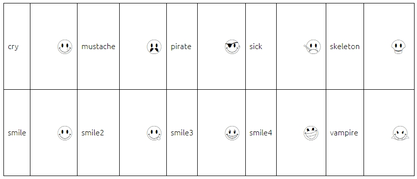
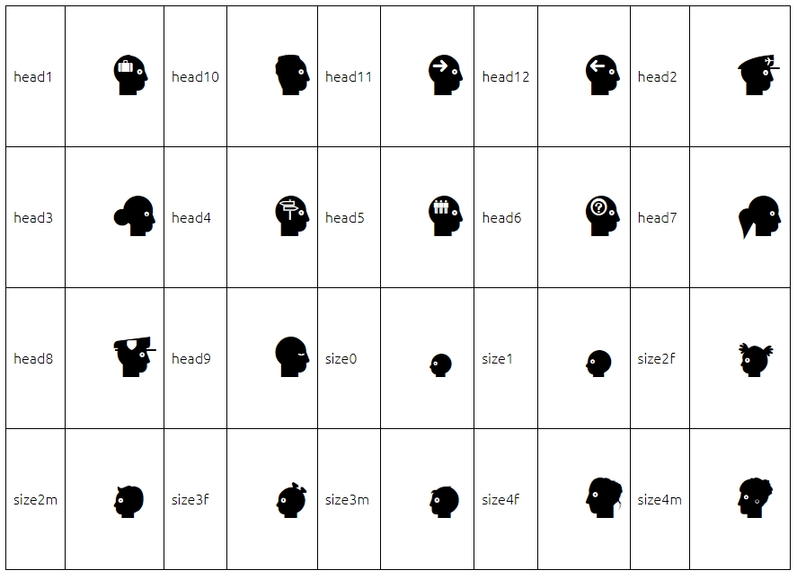
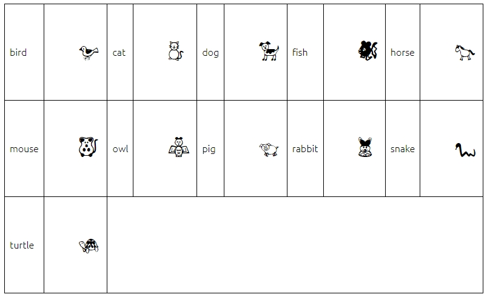
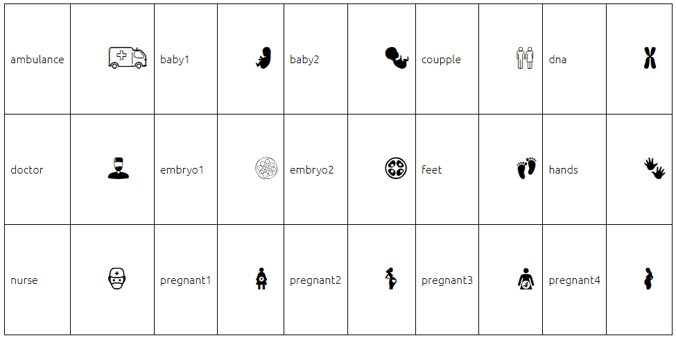
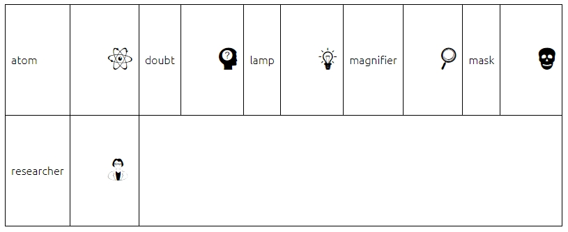
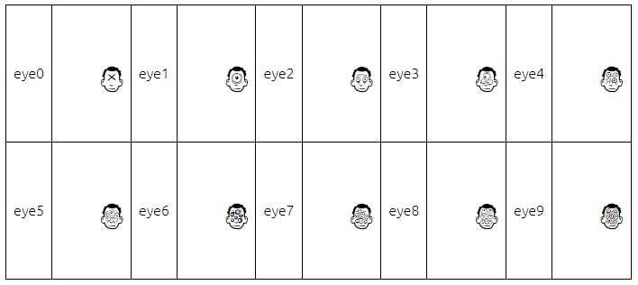
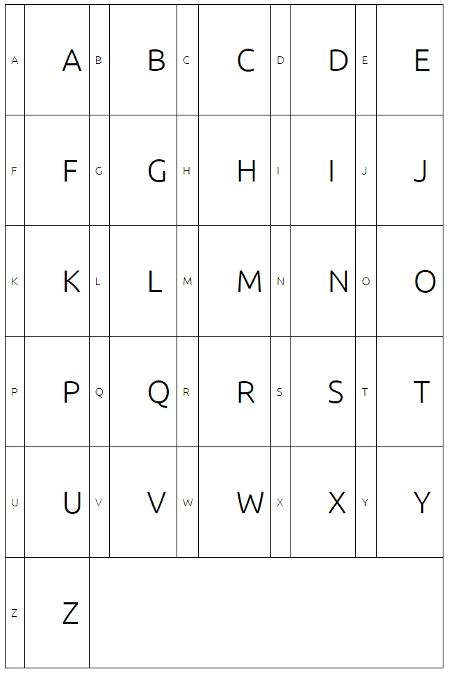

# Font

|                                                        |                                                                                                          |
| ------------------------------------------------------ | -------------------------------------------------------------------------------------------------------- |
| [Chess](./font.md#chess)                               | Chess icons.                                                                                             |
| [Grissom Free](./font.md#grissom-free)                 | Intellecta Design makes research and development of fonts with historical and artistical relevant forms. |
| [JLS Smiles Sampler](./font.md#jls-smiles-sampler)     | Font by Michael Adkins & James Stirling.                                                                 |
| [LL Faces](./font.md#ll-faces)                         | Head faces of different sizes and internal content.                                                      |
| [Pet Animals](./font.md#pet-animals)                   | Pet animals by Zdravko Andreev, aka Z-Designs.                                                           |
| [Pregnancy](./font.md#pregnancy)                       | Pregnancy icons.                                                                                         |
| [Science](./font.md#science)                           | Some science objects and symbols.                                                                        |
| [Freaky Face](./font.md#freaky-face)                   | Some faces with different number of eyes.                                                                |
| [Ubuntu](./font.md#ubuntu)                             | The Ubuntu Font Family are a set of matching new libre/open fonts.                                       |

---

## Chess

**File:** CHEQ_TT.ttf  
**Summary:** Chess icons.  
**Source:** [https://www.dafont.com/chess.font](https://www.dafont.com/chess.font)  
**Symbols:**

---

## Grissom Free

**File:** Grissom Free.ttf  
**Summary:** Intellecta Design makes research and development of fonts with historical and artistical relevant forms. This font is a FREE software for personal and non-commercial use only.  
**Source:** [http://www.dafont.com/grissom.font](http://www.dafont.com/grissom.font)  
**Symbols:**

---

## JLS Smiles Sampler

**File:** JLS Smiles Sampler.ttf  
**Summary:** Font by Michael Adkins & James Stirling. "Have a nice day!" I can remember that motto and the smiley face from childhood. It was friendly, optimistic little image that became an icon. These days it has been updated and is a collection of emoticons used by cultures world wide. The smiley face can now be friendly, sad, happy, angry, etc. This collection is our fun expression of the smiley face.  
**Source:** [http://www.dafont.com/jls-smiles-sampler.font](http://www.dafont.com/jls-smiles-sampler.font)  
**Symbols:**

---

## LL Faces

**File:** LLFACES2.ttf  
**Summary:** Head faces of different sizes and internal content.  
**Source:** [https://www.dafont.com/llfaces.font](https://www.dafont.com/llfaces.font)  
**Symbols:**

---

## Pet Animals

**File:** Pet Animals.ttf  
**Summary:** Pet animals by Zdravko Andreev, aka Z-Designs. This font is free for personal and non-commercial use.  
**Source:** [http://www.dafont.com/pet-animals.font](http://www.dafont.com/pet-animals.font)  
**Symbols:**

---

## Pregnancy

**File:** Pregnancy.ttf  
**Summary:** Pregnancy icons.  
**Source:** [https://www.dafont.com/pregnancy.font](https://www.dafont.com/pregnancy.font)  
**Symbols:**

---

## Science

**File:** Science Icons.ttf  
**Summary:** Some science objects and symbols.  
**Source:** [https://dl.dafont.com/dl/?f=science](https://dl.dafont.com/dl/?f=science)  
**Symbols:**

---

## Freaky Face

**File:** TheFreakyFace.ttf  
**Summary:** Some faces with different number of eyes.  
**Source:** [https://www.dafont.com/the-freaky-face.font](https://www.dafont.com/the-freaky-face.font)  
**Symbols:**

---

## Ubuntu

**File:** Ubuntu-L.ttf  
**Summary:** The Ubuntu Font Family are a set of matching new libre/open fonts. The development is being funded by Canonical on behalf the wider Free Software community and the Ubuntu project. The technical font design work and implementation is being undertaken by Dalton Maag. This font is used in every window displayed by TerraME.  
**Source:** [http://font.ubuntu.com](http://font.ubuntu.com/)  
**Symbols:**

